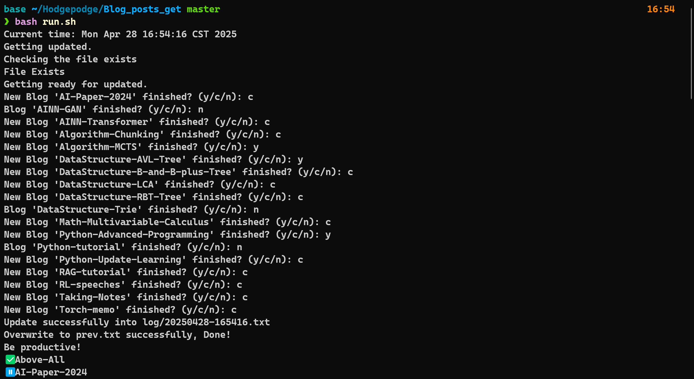
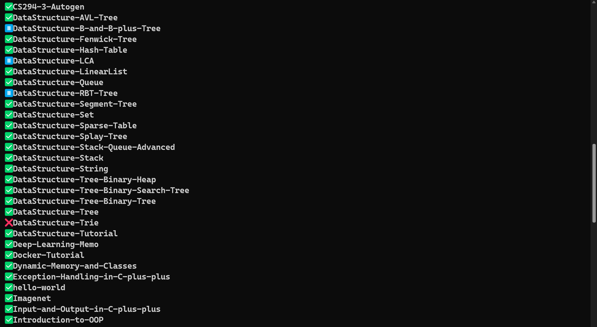

# Blog Update Fetching Script

## My Blog Updating Status

<!-- BEGIN -->
```text
✅Blog-Update-Fetching-Script
✅DataStructure-Hash-Table
✅DataStructure-Disjoint-Set
✅Algorithm-BinaryTree
✅My-WorkFlow
✅My-Multi-Agents
✅LaTeX-tutorial
✅DataStructure-Graph-Mathematical-Basis
✅Life-musings
✅DataStructure-Segment-Tree
✅Torch-Memo-Tensor-Operations
✅Linked-List-Implementation-Based-on-Structs
✅Pointers-Arrays-and-Functions
✅DataStructure-LinearList
✅Deep-Learning-Memo
✅CMake-tutorial-episode2
✅Above-All-en
✅Docker-Tutorial
✅Algorithm-Memo
✅DataStructure-Graph-Introduction
✅Imagenet
✅Python-Scraping-Tutorial
✅DataStructure-AVL-Tree
✅RAG-Blog-Content-Retrieval
✅Leetcode-Mistake-collection-31-40
✅Algorithm-Sorting
✅Python-File-Management
❌DataStructure-Graph-Network-Flow-problem
✅WSL-Proxy
✅Code-Line-Counter
✅CS294-1-LLM-Reasoning
✅Class-Inheritance
✅hello-world
⏸️LLML-CS336-Lecture-2-Pytorch-Resource-Accounting
✅Algorithm-MCTS
✅LLM-Evaluating
✅LLML-Attention
✅Linux-Bash-Introduction
✅Exception-Handling-in-C-plus-plus
⏸️Git-Advanced-Memo
✅DataStructure-B-and-B-plus-Tree
✅DataStructure-Graph-SSSP-problem
✅DataStructure-Tree
✅Above-All-ZH
✅DataStructure-Tutorial
✅Python-Architecture-Patterns
✅DataStructure-Tree-Binary-Search-Tree
✅LLM-Learning-Initial
✅Secure-Shell-and-Encryption
✅Tools-Tutorial
✅Python-Pipe
✅AIBasis-Neural-Networks
✅CLI-Roadmap
✅LLML-Transformer
✅Python-Environment-Modules-Tutorial
✅Introduction-to-OOP
✅DataStructure-LCA
✅Rust-OwnerShip
✅DataStructure-Graph-AOE-and-AOV-Network
⏸️AI-Paper-2024
✅DataStructure-Queue
✅Factor-Mining-in-Quantitative-Investing-A-Survey
✅Dynamic-Memory-and-Classes
✅Python-numpy-cheatsheet
✅Leetcode-Mistake-collection-11-20
✅Code-Reuse-in-OOP
✅LLML-CS336-Lecture-1-Overview-and-Tokenization
✅Announcement
✅Blog-Word-Counter
✅DataStructure-String
✅CamelAI-automatic-essay-modification
✅My-Posts
✅DataStructure-RBT-Tree
✅Leetcode-Mistake-collection-21-30
✅My-Memo
✅Bash-exercises
✅Torch-Memo-TensorBoard
✅Leetcode-Mistake-collection-1-10
✅DataStructure-Tree-Binary-Tree
✅Automaton-NFA
✅DataStructure-Tree-Binary-Heap
✅Regular-Expression
✅Vim-tutorial
✅Python-Threadings
✅CMake-tutorial1
✅Algorithm-BFS-DFS
✅Python-cheatsheet
✅DataStructure-Awesome
✅Pre-training-Is-Dead
✅Algorithm-Introduction
✅DataStructure-Graph-SCC
✅Torch-memo
✅Taking-Notes
✅Math-Integral-Cheatsheet
✅Modern-C
✅Javascripts-Memo
✅DataStructure-Graph-MST-problem
✅DataStructure-Sparse-Table
✅Agents-in-Coding-A-survey
✅Missing-Semester-Notes
✅DataStructure-Stack-Queue-Advanced
✅Python-Package-Manager
✅Feishu-GPU-Auto-Monitoring
✅Python-Architecture-Patterns-Multi-file-Progarmming
✅Leetcode-Mistake-collection
✅Bash-commands
✅DataStructure-Stack
✅Quick-GPT-A-fast-and-simple-CLI-LLM-calling-function
✅DataStructure-Set
✅RAG-tutorial
✅Input-and-Output-in-C-plus-plus
✅Jotting-References-and-Encapsulation-in-OOP
✅My-Bloging-Workflow
✅Javascripts-Advanced
✅Algorithm-Chunking
✅Python-visualization
⏸️RL-speeches
✅Pythonic-Functional-Programming
✅DataStructure-Fenwick-Tree
✅Profiling-and-Debugging
✅C-plus-plus-Primer-Plus-tutorial
✅DataStructure-Splay-Tree
✅CS294-3-Autogen
✅Python-Advanced-Programming
✅Lightweight-speech-recognition-conversion-model
```
<!-- END -->

## Introduction

This is an automation script I implemented in the Hexo blog update to automatically fetch blog updates, compare them with previous update statuses, and allow users to manually determine the update status of unfinished and newly added blogs, thus obtaining the new blog update status.

All Blogs are classified into three major categories:

- ⏸️(Still working)

- ✅(Mostly finished)

- ❌(Barely completed)

## Preliminaries

<div style="padding: 10px; background-color: #E7F5FF; border-left: 5px solid #4DABF7; border-radius: 4px; margin: 10px 0;">
ℹ️ For the latest version, we strongly recommend you to run `main.py` (or `run.sh` directly)! The old version of `main.sh` will no longer be maintained.
</div>

For the latest version, you need to get the **Absolute address** of your `hexo` directories which stores all your **Markdown** files and replace it with the variable of `BLOG_DIR`.

For example, in `main.py`:

```python
#!/home/xiyuanyang/anaconda3/bin/python
# ! ATTENTION: change it to your own python interpreter.
import os
import sys
from datetime import datetime

# Configuration
# ! ATTENTION: replace the BLOG_DIR with your own.
BLOG_DIR = "/mnt/d/Blog/source/_posts"
```

## Usage

### For the new version

You can run the original python scripts:

```bash
python main.py
```
And you will see the answers and the output! Go to [Demo](#Demo) for more details.

Or you can run the bash scripts `run.sh` to achieve more refined output control!

```bash
bash run.sh
```

<details>
<summary>For the old version (not recommended)</summary>


In `main.sh`, change the directory into your own directory:

```bash
DIR="/mnt/d/Blog/source/_posts"

# Change this line into your own directory!
```

Then create a new dir containing logs.

```bash
touch log
```

You need to initialize `prev.txt` for your own blog!

For this document, please maintain the following format: Each line should include a prefix status emoji and the title name. The prefix status emojis include ✅ and ❌, indicating the completion status of the blog. 

An example text is as follows:  

```
❌AI-Paper-2024
❌AI-indepth-reading-AlexNet
✅Above-All
❌Algorithm-BFS-DFS
✅Algorithm-BinaryTree
❌Algorithm-Chunking
✅Algorithm-Introduction
✅Algorithm-Memo
✅Algorithm-Sorting
✅Bash-commands
✅Bash-exercises
✅C-plus-plus-Primer-Plus-tutorial
✅CMake-tutorial-episode2
✅CMake-tutorial1
✅CS294-1-LLM-Reasoning
```

Please ensure that your output structure maintains alphabetical order. You can use the following command line to achieve this: 

```bash
ls $DIR | grep -v ".*\.md" | grep -v ".*\.sh" > ans.txt
```

You only need to initialize it once! The scripts will update it later.

For **Hexo** Blog users, the directory which stores your Blog posts may be like as follows:

- Several `.md` files
- Several directories which has the same name with `.md` files

The `main.sh` will automatically get all file names using the `grep` command:

```bash
ls $DIR | grep -v ".*\.md" | grep -v ".*\.sh" > ans.txt
```

> `grep -v ".*\.sh"` is because I add several `.sh` files into it. You can modify it with your own needs.

Then, the file will compare the new status with the previous status stored in the `prev.txt`. Then the file will ask users to manually determine the update status of unfinished and newly added blogs.


Finally, the scripts will update `prev.txt` and generate a new blog status named `20250330_200559.txt` and you can see the updated status there!

</details>


## Demo





**Enjoy Coding**

## Discussion

Just for fun, and just for `hexo` users.

Welcome PRs.